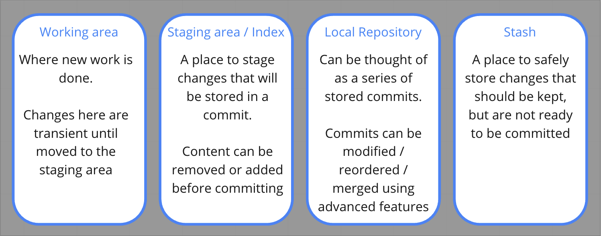

# Git lunch and learn
A starting point for a series of lectures on Git. This is a high level introduction to the fundamentals of understanding Git, to be used in conjunction with a demonstration

## Concepts covered
- The 4 areas and how to move work between them
- Inspecting commit history
- Creating branches and merging work
- Handling merge conflicts

### The 4 areas:

### Useful Vim commands
When resolving merge conflicts or doing more advanced techniques, the Vim text editor may be loaded by default. Some useful basic commands:

| Keystrokes   | Explanation |
| ------------ |  ----  |
| `:q!`   | Quit without saving |
| `:wq`   | Save and quit |
| `i` | Insert. This allows editing of the file. Press ESC to exit this mode |

## Useful commands
| Command       | Overview |
| ------------- |  ----  |
| `git status`   | Invaluable! Check changes in the working and index areas |
| `git switch`   | Move between different branches. Uses include: `git switch branch-name`: Switch to a different branch `git switch -c branch-name`: Create a new branch and switch to it `git switch -`: Switch back to the last branch you checked out |
| `git branch`   | Manage your branches (create, delete and list) Uses include: `git branch`: Lists all current local branches `git branch branch-name`: Create a new branch from your present commit (but does NOT check it out) `git branch -d branch-name`: Deletes given branch from the local repository |
| `git add`   | Move work from the working area into staging. Example usages: `git add .`: Add all untracked files and changes into the staging area `git add -p`: Interactively move through a list of changes in tracked files and choose which segments of each file to stage |
| `git commit`   | Create a commit from the content of the staging area. Example use: `git commit -m 'your detailed commit message'`: Create a commit with a bespoke message attached |
| `git log`   | Show a list of all current commits on your checked out branch. Example uses: `git log`: Show list of commits `git log --oneline`: Show a list of commits (with reduced detail) |
| `git stash`   | Move unstaged content into the stash area. Some uses: `git stash list`: Show all current stashes `git stash push -m 'description of your changes'`: Move all unstaged changes of tracked files into a stash (including a description) `git stash pop`: Remove a single stash and apply it to your working area (the opposite of `git stash push`) |
| `git merge`   | Merge changes from a given target branch into your currently checked out branch. Example (whilst on `main` branch): `git merge some-project-branch`: Run through the commits on the target branch and apply them on top of the parent commit on the `main` branch (this will only work cleanly if there are no new commits on the `main` branch after the commit the side branch was created from). (A detailed explanation is out of scope for this introductory session) |
| `git fetch`   | Checks for any new changes in the remote repository |
| `git pull`    | Pulls down any new changes for your checked out branch into your local working environment |
| `git push`    | Pushes all commits in your lopcal repository to the remote repository branch of the same name |
